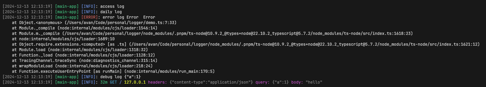

# Logger

A logger for Node.js.

[](https://www.npmjs.com/package/@avanlan/logger)
[](https://www.npmjs.com/package/@avanlan/logger)

[](https://nodei.co/npm/@avanlan/logger/)

## Install

```bash
pnpm i @avanlan/logger
```

## Usage

```ts
import { Logger } from '@avanlan/logger';

const logger = new Logger();

logger.access.info('access log');
logger.daily.info("daily log");
logger.error.error("error log", new Error());
logger.debug.info("debug log", { a: 1 });
logger.access.info({
  time: '32m',
  method: "GET",
  url: "/",
  ip: "127.0.0.1",
  body: "hello",
  headers: {
    "content-type": "application/json",
  },
  query: {
    a: 1,
  },
});
```

output

```bash
[2024-12-13 12:13:19] [main-app] [INFO]: access log
[2024-12-13 12:13:19] [main-app] [INFO]: daily log
[2024-12-13 12:13:19] [main-app] [ERROR]: error log Error  Error
    at Object.<anonymous> (/Users/avan/Code/personal/logger/demo.ts:7:33)
    at Module._compile (node:internal/modules/cjs/loader:1546:14)
    at Module.m._compile (/Users/avan/Code/personal/logger/node_modules/.pnpm/ts-node@10.9.2_@types+node@22.10.2_typescript@5.7.2/node_modules/ts-node/src/index.ts:1618:23)
    at node:internal/modules/cjs/loader:1689:10
    at Object.require.extensions.<computed> [as .ts] (/Users/avan/Code/personal/logger/node_modules/.pnpm/ts-node@10.9.2_@types+node@22.10.2_typescript@5.7.2/node_modules/ts-node/src/index.ts:1621:12)
    at Module.load (node:internal/modules/cjs/loader:1318:32)
    at Function._load (node:internal/modules/cjs/loader:1128:12)
    at TracingChannel.traceSync (node:diagnostics_channel:315:14)
    at wrapModuleLoad (node:internal/modules/cjs/loader:218:24)
    at Function.executeUserEntryPoint [as runMain] (node:internal/modules/run_main:170:5)
[2024-12-13 12:13:19] [main-app] [INFO]: debug log {"a":1}
[2024-12-13 12:13:19] [main-app] [INFO]: 32m GET / 127.0.0.1 headers: {"content-type":"application/json"} query: {"a":1} body: "hello"
```



## Configuration

### Project

Specify the project name.

```ts
import { Logger } from '@avanlan/logger';

const logger = new Logger({
  projectName: "auth-service",
});

logger.daily.info("info log")

// output daily log
// [2024-08-08 16:37:24] [auth-service] [INFO]: info log
```

### Daily Rotate File

```ts
interface DailyRotateFileConfig {
  maxSize?: stringOrNumber;
  maxFiles?: stringOrNumber;
}
```

`maxSize`: Maximum size of the file after which it will rotate. This can be a number of bytes, or units of kb, mb, and gb. If using the units, add 'k', 'm', or 'g' as the suffix. The units need to directly follow the number.

`maxFiles`: Maximum number of logs to keep. If not set, no logs will be removed. This can be a number of files or number of days. If using days, add 'd' as the suffix.

```ts
const logger = new Logger({
  dailyRotateFile: {
    maxSize: 1024 * 1024 * 400, // '400m'
    maxFiles: 14, // '14d'
  },
});
```

### Transports File

```ts
interface TransportsFileConfig {
  maxsize?: number;
  maxFiles?: number;
}
```

```ts
const logger = new Logger({
  transportsFile: {
    maxsize: 1024 * 1024 * 400,
    maxFiles: 14,
  },
});
```

## Output Logger File

```
project
├── logger
│   ├── access
│   │   └── access.YYYY-MM-DD.log
│   ├── daily
│   │   └── daily.YYYY-MM-DD.log
│   ├── error
│   │   └── error.YYYY-MM-DD.log
│   └── debug.log
```

## Logger Middleware

### Koa

```ts
import { Logger, koaHttpLogger } from "@avanlan/logger";
import { bodyParser } from '@koa/bodyparser';

const logger = new Logger();

app.use(bodyparser());
app.use(koaHttpLogger(logger));

// output access log
// [2024-08-08 17:34:20] [main-app] [INFO]: 2ms GET / ::1 headers: {"host":"localhost:8044","user-agent":"curl/8.6.0","accept":"*/*"} query: {} body: {}
```

### Express

```ts
import { Logger, expressHttpLogger } from "@avanlan/logger";
import bodyParser from 'body-parser';

const logger = new Logger();

app.use(bodyParser.json());
app.use(expressHttpLogger(logger));

// output access log
// [2024-08-08 17:47:55] [main-app] [INFO]: 0ms GET / ::1 headers: {"host":"localhost:5834","user-agent":"curl/8.6.0","accept":"*/*"} query: {} body: {}
```

## Features

- [x] Access log
- [x] Daily log
- [x] Error log
- [x] Debug log
- [x] Koa middleware
- [x] Express middleware
- [x] Console support color
